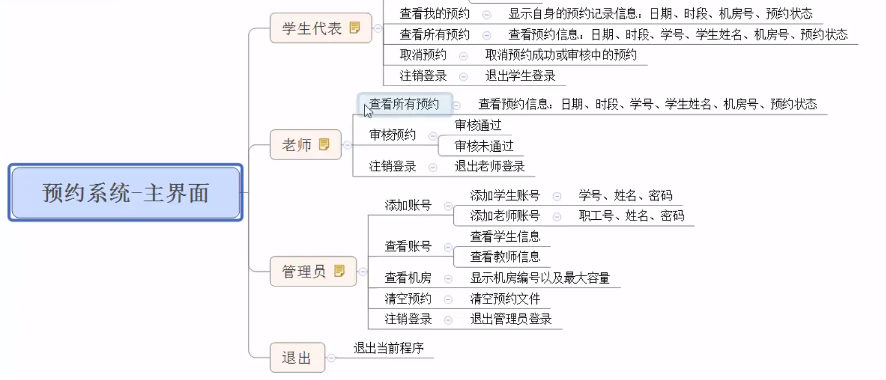

# 机房预约系统
## 身份简介
1. 学生代表：申请使用机房
2. 教师：审核学生的预约申请
3. 管理员：给学生、教师创建账号

## 机房简介
机房总共有3间
1. 1号机房：最大容量20人
2. 2号机房：最大容量50人
3. 3号机房：最大容量100人

## 申请简介
1. 申请的订单每周由管理员负责清空
2. 学生可以预约未来一周内的机房使用，预约的日期为周一至周五，预约时需要选择
   预约时段（上午、下午）
3. 教师来审核预约、根据实际使用情况审核预约通过与否

## 系统具体需求
1. 首先进入登陆界面，可选登陆身份有:

    - 学生代表
    - 教师
    - 管理员
    - 退出
    
2. 每个身份都需要进行验证后，进入子菜单

    - 学生需要输入：学号、姓名、登陆密码
    - 老师需要输入：职工号、姓名、登录密码
    - 管理员需要输入：管理员姓名、登录密码
    
3. 学生具体功能
    
    - 申请预约：预约机房
    - 查看自身的预约：查看自己的预约状态
    - 查看所有预约：查看全部预约信息以及预约状态
        - 预约状态：审核中、预约成功、预约失败、取消的预约
    - 取消预约：取消自身的预约，预约成功或审核中的预约均可取消
    - 注销登录
4. 教师具体功能

    - 查看所有预约：查看全部预约信息以及预约状态
    - 审核预约：对学生的预约进行审核
    - 注销登录
    
5. 管理员具体功能
    - 添加账号：添加学生或者教师的账号，需要检测学生编号或教师职工号是否重复
    - 查看账号：可以选择查看学生或教师的全部信息
    - 查看机房：查看所有机房的信息
    - 清空预约：清空一周所有预约记录
    - 注销登陆
    
6. 拓展功能：
    
    - 拉黑学生功能：对于频繁预约取消的同学，不让其申请机房
    - 机房维护功能：对新增、故障机房做标记，不让预约
    - 机房预约状态检测：对于故障、已被预约成功的电脑不让预约
    - 密码修改功能：输入学号，正确则可以提供修改密码功能

      
# 实现流程
## 创建身份类
1. 在整个系统中，有三种身份。分别为：`学生代表`，`老师`以及`管理员`
2. 三种身份有其他共性也有其特性，因此我们可以将三种身份抽象出一个**身份基类**
`identity`
   
## 学生类功能分析
1. 学生类主要功能是通过类中成员函数，实现`预约实验室`操作
2. 主要功能有

   - 显示学生操作的菜单界面
   - 申请预约
   - 查看自身预约
   - 查看所有预约
   - 取消预约
   

## 教师类功能分析
1. 教师主要功能是查看学生的预约，并进行审核
2. 其主要功能有：

   - 显示教师操作的菜单界面
   - 查看所有预约
   - 审核预约
   
## 管理员类功能分析

1. 管理员类主要功能是对学生和教师账户进行管理，查看机房信息以及清空预约记录
   
2. 其主要功能有： 
   - 显示管理员操作的菜单界面
   - 添加账号
   - 查看账号
   - 查看机房信息
   - 清空预约记录

## 登录模块
### 全局文件添加
1. 不同的身份可能会用到不同的文件操作，我们可以将所有的文件名定义到一个全局的
文件中
   
2. 在头文件夹中添加`globalFile.h`文件
3. 并添加如下代码
```c++
#define ADMIN_FILE "files/admin.txt" //管理员文件
#define STUDENT_FILE "files/student.txt" //学生文件
#define TEACHER_FILE "files/teacher.txt" //教师文件
#define COMPUTER_FILE "files/computerRoom.txt" //机房信息文件
#define ORDER_FILE "files/order.txt" //订单文件

```

### 登录函数封装
功能描述：根据用户的选择，进入不同的身份登录

在预约系统的`.cpp`文件中添加全局函数`void LoginIn(string fileName
int type)`
- fileName：操作的文件名
- type：登录的身份（1：学生，2：教师，3：管理员）


# 知识点总结
## 实现流程
1. 需求分析
2. 开始主菜单
3. 退出功能实现
4. 创建身份类
   
   - 身份基类
   - 学生类
   - 教师类
   - 管理员类
   
5. 登录模块

   - 全局文件添加
   - 登陆函数封装
   - 学生登录实现
   - 教师登录实现
   - 管理员登录实现

## C++面向对象的三大特性
1. 多态
- 利用父类指针指向子类对象

2. `static`关键字
   
## 小技巧
1. 全局文件宏定义的好处

