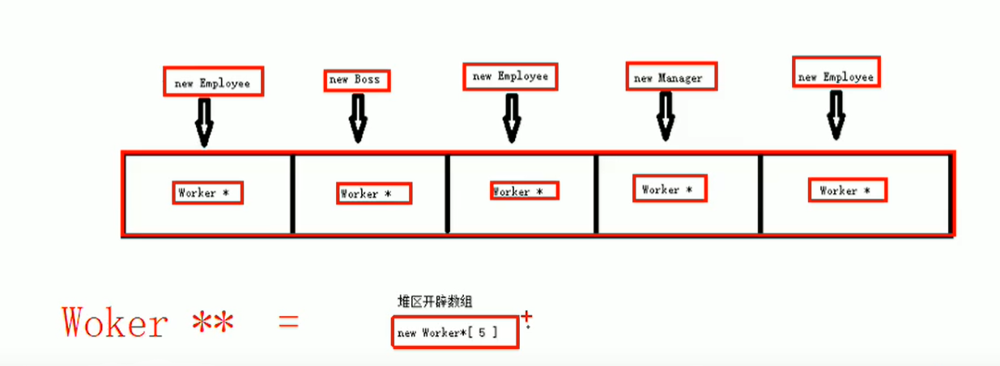

# staffGovSystem
## 基于多态的职工管理系统设计
公司中职工分为三类：普通员工、经理、老板，显示信息时，需要显示职工编号、
职工姓名、岗位、职责

普通员工职责：完成经理交给的任务

经理职责：完成老板交给的任务，并下发任务给员工

老板职责：管理公司所有事物

## 管理系统中需要实现的功能：

1. 退出管理程序：退出当前管理系统
2. 增加职工信息：实现批量添加职工功能，将信息录入到文件中，职工信息为：
职工编号、姓名、部门编号
3. 显示职工信息：显示公司内部所有职工的信息
4. 删除离职员工：按照编号删除指定的员工
5. 修改职工信息：按照编号修改职工个人信息
6. 查找职工信息：按照职工的编号或者职工的姓名进行查找
7. 按照编号排序：按照职工编号，进行排序，排序规则由用户指定
8. 清空所有文档：清空文件中记录的所有职工信息（请空前需再次确认，防止误删）

## 实现流程
1. 创建管理类
2. 菜单功能
3. 退出功能
4. 创建职工类
5. 添加职工
6. 文件交互-写文件
7. 文件交互-读文件
8. 显示职工
9. 删除职工
10. 修改职工
11. 查找职工
12. 排序
13. 清空文件

## 添加职工
功能描述：批量添加职工，并且保存到文件中
### 功能分析
用户在批量创建时，可能会创建不同种类的职工

如果想将所有不同种类的员工都放入到一个数组中，可以`将所有员工的指针维护到一个
数组里`

如果想在程序中，维护这个不定长度的数组，可以将`数组创建到堆区`，并利用
`Worker**`的指针维护**利用父类指针**
