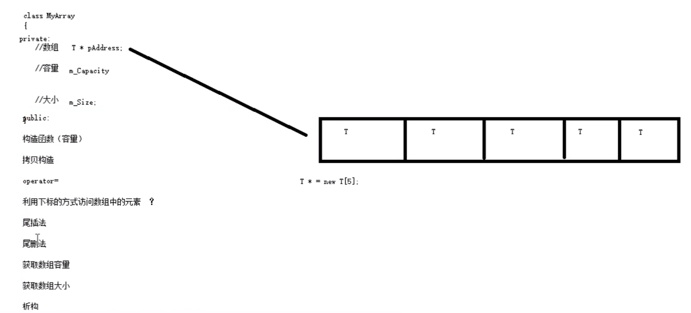

# 类模板经典案例
案例描述：实现一个通用的数组类，要求如下：
1. 可以对内置数据类型以及自定义数据类型的数据进行存储
2. 将数组中的数据存储到堆区
3. 构造函数中可以传入数组的容量
4. 提供对于的`拷贝构造函数`以及operator=防止`浅拷贝问题`
5. 提供尾插法和尾删法对数组中的数据进行增加和删除
6. 可以通过下标的方式访问数组中的元素
7. 可以获取当前数组中元素个数和数组的容量



## 知识点总结
1. 类模板对象做函数参数的三种传入方式
    1. 指定传入的类型：直接显示对象的数据类型  **最常用**
       ```cpp
       //定义一个函数来打自定义数组的元素
        void printArray(MyArray<int> &arr){
        for(int i = 0; i < arr.get_Size(); i++){
        cout<<arr[i]<<endl;
        }
        }
       ```
    2. 参数模板化：将对象中的参数变为模板进行传递
    3. 整个类模板化：将这个对象类型模板进行传递
1. 拷贝构造函数
   ```cpp
       //拷贝构造函数
    MyArray(const MyArray& arr){
        cout<<"MyArray拷贝构造调用"<<endl;

        this->m_Capacity = arr.m_Capacity;
        this->m_Size = arr.m_Size;
        //this->pAddress = arr.pAddress; //浅拷贝问题
        this->pAddress = new T[arr.m_Capacity]; //深拷贝实现

        //将arr中的数组都拷贝过来
        for(int i = 0; i < arr.m_Size; i++){
            this->pAddress[i] = arr.pAddress[i];
        }
    }
   ```
2. 浅拷贝问题
   
3. 运算符重载
   ```c++
    //实现通过下标方式访问数组中的元素
    T& operator[](int index){ //返回引用，即返回数据本身，可以进行左值操作
        return this->pAddress[index];
    }
   ```
4. 类函数方法类外实现
    ```cpp
    template<typename T>
    void MyArray<T>::print_end(){
            if(this->m_Size == 0){
                cout<<"当前数组为空，无法打印"<<endl;
            }
            else{
                cout<<"当前数组的最后一个元素是:"
                    <<this->pAddress[this->m_Size-1]<<endl;
            }
    }
    ```
5. 自定义类型数组，如`class`
    ```cpp
    //测试自定义数据类型
    class Person{
    public:
        Person(){
    
        };
        Person(string name, int age){
            this->m_name = name;
            this->m_age = age;
        }
        string m_name;
        int m_age;
    
    };
    
    //定义打印Person数组
    void printPersonArray(MyArray<Person> & arr){
    for(int i = 0; i < arr.get_Size(); i++){
    cout<<"姓名:" <<arr[i].m_name
    <<"年龄:" << arr[i].m_age<<endl;
    }
    }
    
    void test03(){
    MyArray<Person> arr(10);
    
    Person p1("孙悟空", 999);
    Person p2("韩信", 20);
    Person p3("吕布", 35);
    Person p4("张飞", 44);
    
    //将数据插入到数组中
    arr.Push_Back(p1);
    arr.Push_Back(p2);
    arr.Push_Back(p3);
    arr.Push_Back(p4);
    
    printPersonArray(arr);
    }
    ```
6. 类模板与继承 
   
   当类模板碰到继承时，需要注意以下几点：
   1. 当子类继承的父类是一个类模板时，子类在声明的时候，要指定出父类中T的类型
   2. 如果不指定，编译器无法给子类分配内存
   3. 如果想灵活指定出父类中T的类型，子类也需变为类模板
   ```cpp
   //实现子类继承
   class sonArray :public MyArray<int>{ //必须指定父类中T的类型
   public:
   sonArray(){
   cout<<"sonArray的构造函数"<<endl;
   }
   };
   
   template<class T1 = int, class T2 = char> //类模板参数类型可以有默认值
   class sonArray1 :public MyArray<T1>{
   public:
   sonArray1(){
   cout<<"子类构造函数调用" <<endl;
   }
   
       void show_info(){
           cout<<"相关信息如下:";
   //            <<"grade = " << this->m_grade<<endl;
   }
   private:
    T2 m_grade;
   };
   ```