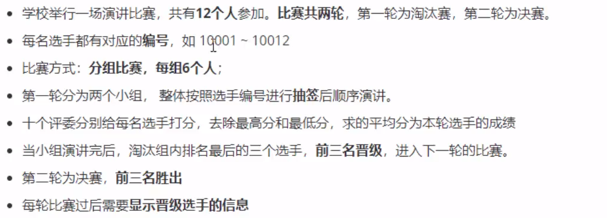
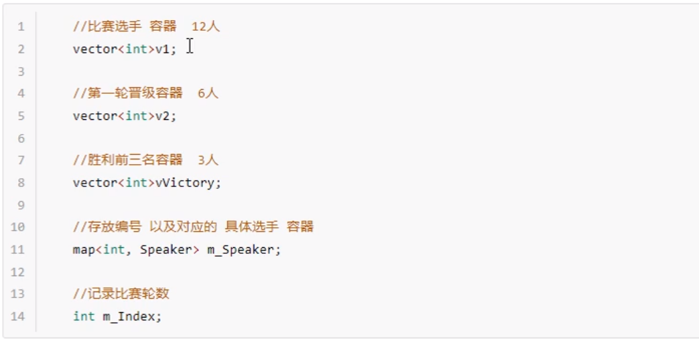

# 基于STL的演讲比赛流程管理系统
## 演讲比赛需求
### 比赛规则

### 程序功能
1. 开始演讲比赛：完成整届比赛的流程，每个比赛阶段需要给用户一个提示，用户按
   任意键后继续下一阶段
   
2. 查看往届记录：查看之前比赛前三名结果，每次比赛都会记录到文件中，文件用`.csv`
后缀名保存
   
3. 清空比赛记录：将文件中数据清空
4. 退出比赛程序：可以退出当前程序

## 演讲比赛功能实现
1. 流程分析
- 抽签->开始演讲比赛->显示第一轮比赛结果―>抽签->开始演讲比赛->显示前三名结果
->保存分数
  
2. 创建选手类
- 选手类中的属性包含：`选手姓名、分数`

3. 比赛
- 成员属性添加：在`speachManager.h`中添加属性

  
4. 抽签
- 在正式比赛前，将所有选手的比赛顺序达伦，只需要将存放选手编号的容器，打乱次序即可
- 在`speechManager.h`中提供抽签的成员函数`void speechDraw()`

5. 保存分数
将每次演讲比赛的得分记录保存到文件中。
   
6. 查看记录
- 在`speechManager.h`中添加`读取`保存记录的成员函数`void readRecord()`
- 添加判断文件是否为空的标志`bool fileIsEmpty`
- 添加往届记录的容器`map<int, vector<string>> m_Record`其中`m_Record`
中的value代表第几届，value记录具体的信息
# 实现流程
1. 创建一个speechManager类，里面包含必要的功能函数和属性
2. 创建一个选手类，包含属性有`编号`、`成绩`
3. 通过speechManager类的构造函数，进行系统初始化
4. 创建一系列选手对象，并初始化其成绩
5. 对选手根据不同的轮次进行`打分`、`求取平均分`、`计算排名`等操作
6. 将第二轮比赛的前三名成绩保留
7. 读取和打印保留的成绩
8. 实现程序退出、文件清空等操作

# 经验总结
## STL常用容器使用

### vector


### map
- 元素插入：`insert()`
- 插入元素类型：`pair对组类型`

### string
1. `string.size()` //字符串长度
2. `string.substr(start, end)` //截取指定的字符串
## 文件操作
1. 包含头文件`#include<fstream>
2. 创建流对象:`ifstream`,`ofstream`
3. 文件操作
   
   - ios::out | ios::app //用追加的方式写文件
   - ios::in //读文件
   - ios::trunc //如果文件存在，则删除并重新创建
   
4. 逐行读取文本文件的数据
   
   - getline(ifs, data); //逐行读取数据并保存于data中，直至全部数据全部读取
   
## 元素遍历新方式？
```c++
    for (auto & mit : sm.m1) {
        cout << "编号:" << mit.first << "姓名" << mit.second.m_name << endl;
    }
```

## `explicit`
通过将**构造函数**声明为`explicit`，可以阻止他们被用来执行**隐式类型转换**，尽管他们仍然可以进行**显式类型转换**

因此，除非允许构造函数被用于隐式类型转换，否则将其声明为`explicit`
## `auto`
